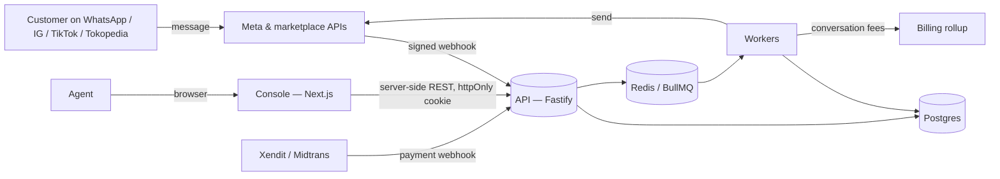

# Architecture

Kirana is a multi-tenant conversational CRM. The product thesis — *the chat is
the record* — drives every structural decision below: conversations are the
primary object, deals and analytics are derived from them, and the unit of
billing is a conversation rather than a seat.

This document describes what is built in this repository. Where something is
designed but not yet implemented it says so.

---

## 1. System context



Everything a customer says arrives as a webhook; everything we say leaves
through a worker. No request path talks to a provider synchronously.

## 2. Components

| Component | Runtime | Responsibility |
|---|---|---|
| `apps/api` | Fastify 5, Node 24 | Authentication, authorisation, reads, command intake, webhook ingress |
| `apps/worker` | BullMQ consumers | Normalisation, sending, Autopilot drafting, metering rollups, retention, audit verification |
| `packages/core` | pure TypeScript | Domain rules with no I/O: pricing, permissions, metering, WhatsApp policy, crypto |
| `packages/db` | SQL + thin query layer | Schema, row-level security, tenant context, repositories |
| `apps/console` | Next.js 15, React 19 | The agent console, in Bahasa Indonesia — server-rendered, tokens held server-side |
| `apps/marketing` | static HTML | The public site and its price configurator |

`packages/core` has no database or network imports. That is what makes the
pricing rules and the WhatsApp window rules testable as arithmetic, and it is
why `tests/pricing.test.ts` can pin the published price list without a database.

**These layering rules are tested, not just described** (`tests/architecture.test.ts`).
Two of them had quietly stopped being true before the tests existed: an alert
sink in `core` was making HTTP requests — with no import to give it away, because
it closed over the global `fetch` — and the cross-tenant escape hatch had grown
from three call sites to twenty-three. The tests now check capabilities rather
than imports, and pin the escape hatch to an explicit allowlist.

## 3. The two request paths that matter

### Inbound: webhook to conversation

1. `POST /v1/webhooks/meta` verifies `X-Hub-Signature-256` over the **raw
   bytes**. A custom content-type parser keeps the buffer (`apps/api/src/app.ts`)
   because verifying a re-serialised body is the standard way this check gets
   silently defeated.
2. The payload is spooled into `webhook_events`, which has a unique index on
   `(provider, external_id)`. That index is the idempotency barrier: providers
   retry, and the second delivery inserts nothing.
3. The route returns 200 immediately and enqueues `inbound.normalise`. A
   provider that does not get a fast 200 retries, and retries during an incident
   are how a queue becomes a stampede.
4. The worker claims the spool row with a conditional update, resolves
   `phone_number_id → channel → tenant`, then opens that tenant's context and
   writes contact, conversation, message and meter in **one transaction**.

### Outbound: reply to provider

1. The API writes the message row and an `message_outbox` row in the same
   transaction as the conversation update — the transactional outbox pattern.
   There is no state where a reply is saved but unsendable, or sent but unsaved.
2. `outbound.send` re-applies the policy gate (`guardOutbound`) before calling
   Meta. It is re-applied deliberately: a message may have waited in the queue
   long enough for the 24-hour window to close, and an automation or a retry must
   not be able to route around the rule.
3. On success the outbox row is deleted and Meta's conversation fee is recorded
   in `meta_cost_events` for pass-through billing.

## 4. Two meters

This is the part most WhatsApp CRMs get wrong, so it is explicit here.

| Meter | Unit | Where | Why |
|---|---|---|---|
| **Ours** | one contact per rolling 24h, per tenant | `billable_conversations` | What the customer pays us. Simple to explain, generous by design. |
| **Meta's** | per business number, per 24h, per category | `meta_cost_events` | What Meta charges us. Passed through at cost, on its own invoice line. |

They use different clocks on purpose (`packages/db/src/repo.ts`):

- The **reply window** runs on the provider's timestamp. Taking our own arrival
  time would let a queue delay convince us a window is open after Meta has
  closed it, and Meta would reject the send.
- The **billing window** runs on arrival time, which keeps metering monotonic
  and immune to a redelivered webhook carrying an old timestamp.

Metering takes a transaction-scoped advisory lock on `(tenant, contact)` before
deciding. A unique index cannot express "one row where `expires_at > now()`",
because `now()` is not immutable — so the lock is the guarantee, and
`tests/metering.test.ts` asserts it under a concurrent burst.

## 4a. Autopilot

Three phases, and the middle one is deliberately outside any transaction —
holding a Postgres connection open across a multi-second model call is how a
worker pool starves under load.

```
read context (tx)  →  generate (no tx)  →  check, decide, persist (tx)
   conversation          Claude, or the        guardrails vs catalogue
   catalogue             offline stand-in      draft row + metering + audit
   policy                                      auto-send only if spotless
```

When tools are available the middle phase is a bounded agent loop (8 steps):
the model calls `cari_produk`, `susun_pesanan`, `simpan_alamat`,
`konfirmasi_pesanan`, and must finish with `balas` — the only tool whose output
reaches a customer. Each tool opens its own short transaction, so nothing is held
open across the model call. Orders, order items, shipping rates and checkout
links live in migration `0009`; the money is computed in `packages/core/src/orders.ts`,
never by the model.

The model is given the tenant's catalogue as data and returns structured claims
(`citedSkus`, `claimsInStock`) alongside its text. Those claims are what the
guardrails verify — prose is not checkable, claims are. See `docs/SECURITY.md`
§ 7b for the rule table and the prompt-injection story.

Retrieval is keyword scoring over the tenant's catalogue, reading the last three
customer turns rather than only the final message — a question is often spread
across two quick lines, and retrieving on the last one loses the subject.
Policies are always included regardless of overlap. For a catalogue of hundreds
of items this is the right tool and it is inspectable when it picks wrong;
pgvector is the step after that, not before.

## 4b. Looking across tenants

Background work is inherently cross-tenant: someone has to enumerate workspaces
to expire orders, chase invoices or verify audit chains. That need is served by
three primitives in `packages/db/src/platform.ts` rather than by an open hole:

| Primitive | Returns | Used by |
|---|---|---|
| `eachTenant(control, purpose)` | ids, status, retention days | every sweep job |
| `resolveWorkspace(control, slug)` | id and status only | sign-in, refresh, MFA |
| `platformHealthSnapshot(control)` | eight numbers | the health checks |

None of them can read a message, a contact or an order. Everything else still
goes through `withTenant`, and the six remaining raw `withoutTenant` calls all
run before a tenant context can exist.

## 5. Tenancy

Single database, shared schema, **row-level security on every tenant table**.

```
withTenant(db, tenantId, fn)
  └─ BEGIN
     ├─ select set_config('app.tenant_id', $1, true)
     ├─ set local role kirana_app          -- unprivileged, FORCEd policies
     └─ fn(tx)                             -- every query filtered by the database
```

An unset context yields `NULL`, every policy comparison against `NULL` is false,
and the query returns zero rows. Isolation fails **closed**, not open.

Three roles, and the separation is real:

- `kirana_app` — what the API and workers use. Cannot read `webhook_events`,
  cannot `UPDATE` or `DELETE` `audit_events`, cannot create a tenant.
- `kirana_ingest` — the raw webhook spool only.
- `kirana_provisioner` — may insert a `tenants` row and nothing else, scoped by a
  role-targeted policy rather than a `BYPASSRLS` grant.

`tests/rls.test.ts` proves each of these against a real Postgres, including that
a known row id from another tenant returns nothing and that an attempt to move a
row across tenants is rejected by the database rather than by application code.

## 6. Data model

Twenty-two tables in seven migrations. The shape worth knowing:

- `contacts` — one per customer per tenant, identified by a **blind index** over
  the normalised phone number, so `0812…` and `+62 812…` are the same person and
  neither is stored in a searchable form.
- `conversations` — one live thread per (contact, channel), enforced by a partial
  unique index so ingestion is an idempotent upsert rather than a check-then-insert
  race. (That race was real; the concurrency test found it.)
- `messages` — bodies encrypted at rest, deduped on `(tenant, channel, provider_message_id)`.
- `deals` / `pipeline_stages` — stages carry `auto_advance_on`, so a payment
  webhook moves the deal and nobody drags a card on a Friday.
- `audit_events` — append-only and hash-chained; each row commits to the previous one.
- `usage_counters` — atomic `INSERT … ON CONFLICT DO UPDATE` bumps. Never
  read-modify-write.

Money is integers throughout: rupiah for prices, micros for anything that gets
multiplied (deal values, pass-through costs). No floats touch a balance.

## 6a. Every job can be run twice

The queue retries. A job that is not safe to run twice is a bug waiting for a
network blip, so each one states what protects it:

| Job | What makes a second run harmless |
|---|---|
| `inbound.normalise` | Claims the spool row with a conditional update; message ingest dedupes on the provider's id |
| `outbound.send` | Refuses anything not still `queued` |
| `autopilot.draft` | One draft per inbound message — a pre-check, and a unique index behind it for the race |
| `billing.rollup` | One invoice per billing period, by partial unique index |
| `email.send` | One row per (template, reference); a failed send is marked failed so a retry is allowed |
| `billing.dunning` | Reminder count is the cursor; re-evaluating returns "none" for what is done |
| `orders.expire` | Only touches orders still `awaiting_payment` |
| `keys.rotate` | Cursor per table; the old key survives until every table completes |
| `retention.purge` | Redacts only rows not already redacted |
| `health.checks`, `audit.verify`, `usage.thresholds` | Read-only |
| `security.sweep` | Read-only, but re-alerts by design — a deadline nobody acted on should be mentioned again |

`autopilot.draft` was the exception until 2026-08-26: a retry called the model
again and billed the tenant for a second AI reply. Retries are supposed to be
free, and now they are.

## 7. Failure behaviour

| Failure | Behaviour |
|---|---|
| Meta returns 5xx | Queue retries with exponential backoff, 8 attempts; outbox row records attempts and last error |
| Meta returns 4xx | Marked permanent, message set `failed`, outbox row cleared — no infinite retry |
| Redis down | API still serves reads and accepts webhooks (spooled); sends stall and resume when Redis returns |
| Postgres failover | Requests fail fast; the outbox and spool mean nothing already accepted is lost |
| Duplicate webhook | Rejected by unique index at spool, and again by message dedupe at ingest |
| Worker dies mid-send | Message stays `queued` with an outbox row; the relay picks it up |
| Number quality drops to flagged | `guardOutbound` pauses sends before Meta blocks the number |

## 8. Scaling notes

The API is stateless and scales horizontally. The first real limits, in order:

1. **Postgres write throughput on `messages`** — the natural next step is
   partitioning by month; the schema is already write-mostly with no updates
   to old rows.
2. **Per-number send rate** — Meta's cap, not ours. `sendRatePerSecond()` paces
   by quality rating; going wider means more numbers, not more workers.
3. **Advisory lock contention on a single hot contact** — bounded by one
   contact's message rate, so not a real ceiling.

Read replicas are appropriate for analytics; the RLS policies apply there
unchanged, which is the main benefit of enforcing tenancy in the database.

## 9. What is not built yet

Named honestly, because a design document that pretends is worse than useless:

- Streaming updates. The console polls every 10 seconds and says so; the honest
  alternative is Postgres `LISTEN/NOTIFY` behind an SSE endpoint, which changes
  one component (`components/AutoRefresh.tsx`).
- English (or any second language) in the console. All user-facing strings sit in
  `apps/console/lib/copy.ts`, so a second language is a second file plus a cookie
  — but there is one language today, and that is deliberate: two half-maintained
  translations are worse than one good one.
- Broadcast campaigns, the flow builder, and the analytics rollups.
- Invoice delivery and payment collection (drafts are produced; nothing is sent).
- SSO/SAML, and API-key authentication at the edge (the schema and scope model exist).

## 10. Decisions

See `docs/adr/`. The load-bearing ones:

- [0001](adr/0001-row-level-security-for-tenancy.md) — tenancy in the database, not in the ORM
- [0002](adr/0002-sql-first-schema.md) — SQL-first migrations rather than a generated schema
- [0003](adr/0003-conversation-window-billing.md) — billing on conversation windows
- [0004](adr/0004-transactional-outbox.md) — the outbox instead of send-on-request
- [0005](adr/0005-application-level-field-encryption.md) — envelope encryption with blind indexes
